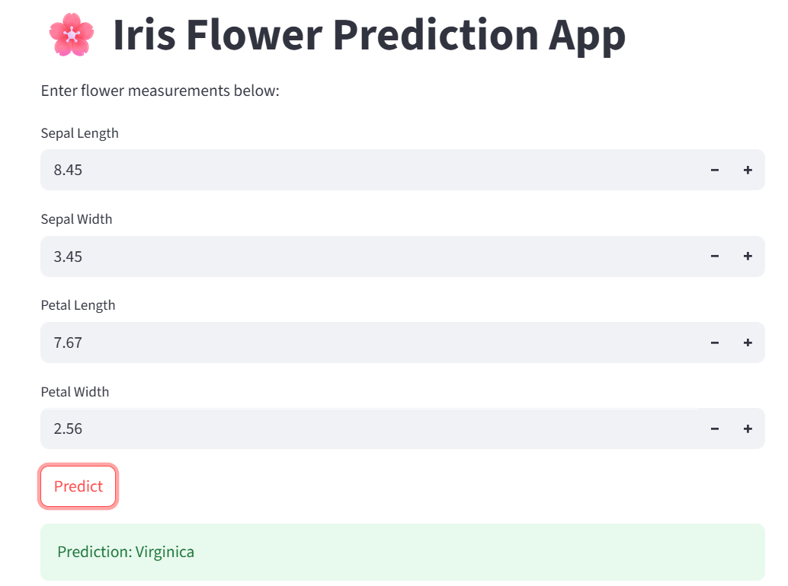

📊 Iris Classification App
This is a simple Streamlit web app that uses a machine learning model to classify iris flower species based on user input features.

🌱 About the Project
This project is built using:

Streamlit for creating an interactive web interface.

Scikit-learn for training a classification model (like Logistic Regression or SVM).

Iris dataset from sklearn for demonstration.

Users can input sepal length, sepal width, petal length, and petal width, and the app predicts the species of the iris flower.

🚀 How to Run the App Locally
Clone the repository

git clone https://github.com/hafiz-haris33/iris_app.git
cd iris_app
Create and activate virtual environment (optional but recommended)

python -m venv venv
venv\Scripts\activate  # For Windows
Install dependencies

pip install -r requirements.txt
Run the app

streamlit run app.py
📂 File Structure

iris_app/
│
├── app.py              # Main Streamlit app
├── model.pkl           # Saved ML model (optional)
├── requirements.txt    # Python dependencies
├── README.md           # Project overview
├── .gitignore          # Files/folders to exclude from Git tracking
└── venv/               # Virtual environment (excluded via .gitignore)

📦 Dependencies
streamlit

pandas

scikit-learn

matplotlib (if visualization used)

All dependencies can be installed via:

pip install -r requirements.txt

📸 App Preview

📌 License
This project is for educational purposes only. You are free to use and modify it.
